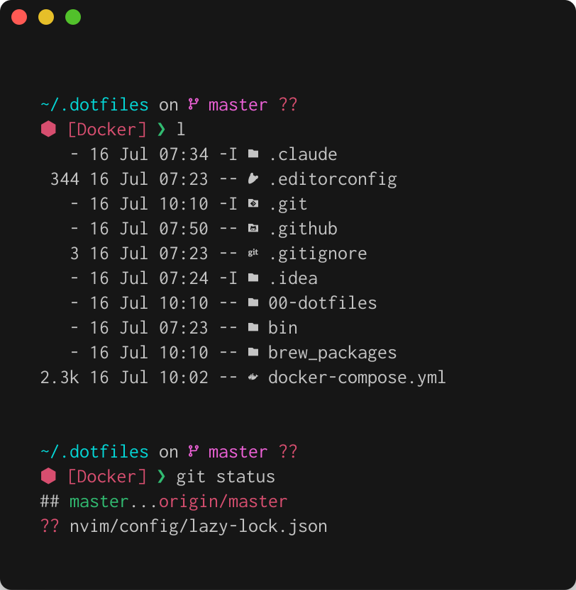

# Cid's dotfiles

> Config files for fish, editors, terminals and more — for macOS and Linux.



## Installation

### Dependencies

First, make sure you have these installed:

- `git`: to clone the repo
- `curl`: to download some stuff
- `tar`: to extract downloaded stuff
- `fish`: to actually run the dotfiles
- `sudo`: some configs may need it

### Install

Then run:

```console
git clone https://github.com/supercid/dotfiles.git ~/.dotfiles
cd ~/.dotfiles
./script/bootstrap.fish        # macOS
./script/bootstrap.fish --linux # Linux (installs packages via apt where possible)
```

Then close and open your terminal again.

> All changed files are backed up with a `.backup` suffix.

The `--linux` flag makes the bootstrap install the toolset with `apt-get`,
falling back to pinned upstream release binaries for the tools Debian doesn't
package (neovim, yazi, terraform, terragrunt, curlie, red-tldr, …). It fails
loudly if any expected tool is missing, so it doubles as a CI check.

## Testing in Docker

The whole setup can be built and exercised in a throwaway container — handy for
trying changes without touching your machine, and for CI:

```console
docker compose run --rm dotfiles       # native arch (mac/linux dev box)
docker compose run --rm dotfiles-pi     # linux/arm64, mirrors a Raspberry Pi
docker compose run --rm dotfiles-ci     # linux/amd64, deterministic CI target
docker compose run --rm dotfiles-dood   # + docker CLI, uses the host daemon
docker compose run --rm dotfiles-dind   # + a nested docker daemon (isolated)
```

The GitHub Actions workflow builds the image on both architectures and runs a
docker-in-docker smoke test, so a package that moves or disappears turns CI red.

## Recommended software

For macOS I recommend:

- [`ghostty`](https://ghostty.org): the terminal emulator I use;
- [`fzf`](https://github.com/junegunn/fzf): fuzzy finder;
- [`bat`](https://github.com/sharkdp/bat): a `cat` replacement;
- [`eza`](https://github.com/eza-community/eza): a `ls` replacement;
- [`jq`](https://github.com/jqlang/jq): a JSON processor with syntax highlighting;
- [`starship`](https://starship.rs): the prompt this config uses;
- [`git-delta`](https://github.com/dandavison/delta): better git diffs;
- [`kubectx`](https://github.com/ahmetb/kubectx): quick Kubernetes context/namespace switching;
- [`grc`](https://github.com/garabik/grc): colorize command output;
- [`gh`](https://github.com/cli/cli): GitHub from the terminal.

The full list of what gets installed lives in `brew_packages/install.fish`.

### Fonts

The prompt and file listings use Nerd Font glyphs. The `fonts` topic installs
Inconsolata (Nerd Font) — configure your terminal to use it.

## Editor

Neovim is configured with [LazyVim](https://www.lazyvim.org); the config is
versioned under `nvim/config` and symlinked to `~/.config/nvim`. On Linux the
bootstrap installs a Neovim release new enough for LazyVim.

## macOS defaults

Run it — **read and tweak it first!**

```console
$DOTFILES/macos/set-defaults.sh
```

Then log out and back in / restart.

## Default `EDITOR` and `PROJECTS`

The default `EDITOR` is `vim`; override it with your own local config.
`PROJECTS` defaults to `~/Developer`, and the shortcut to that folder in the
shell is `dev`.

## Topical

Everything's built around topic areas. To add a new area to your forked
dotfiles — say, "Erlang" — add an `erlang` directory and put files in it.
Anything in a `conf.d` directory or with a `.fish` function is linked into your
fish config. Anything with a `.symlink` extension is symlinked without the
extension into `$HOME` when you run `script/bootstrap.fish`.

## Personalization

> How to add custom configuration without messing up the local repository.

### For git

Change `~/.gitconfig` directly — it includes the dotfiles-managed one.

### For ssh

Edit `~/.ssh/config.local`.

## License

- [License](/LICENSE.md)

## Contributing

Feel free to contribute. Pull requests are automatically checked/linted with
[Shellcheck](https://github.com/koalaman/shellcheck) and
[shfmt](https://github.com/mvdan/sh).
